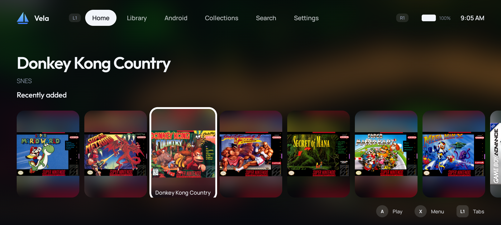
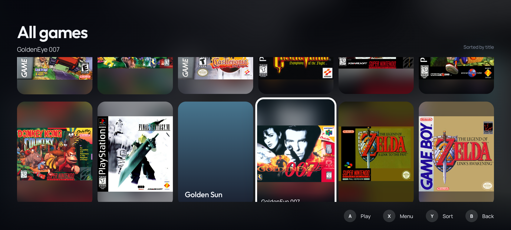
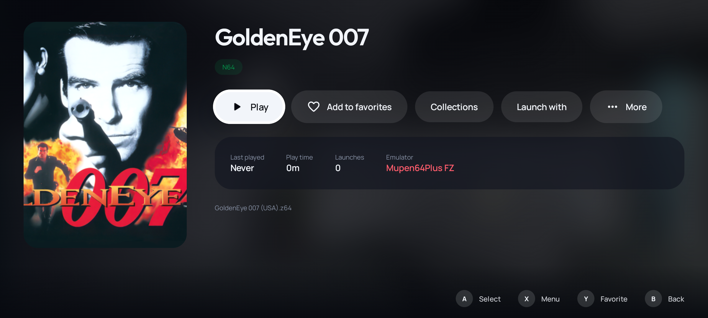
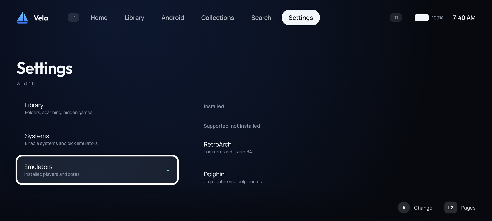

# Vela

Vela is an open-source console-style frontend for Android handhelds (AYN Odin, Retroid Pocket and
similar). It turns the device into a dedicated gaming console: pick a system, pick a game, the
right emulator starts, and when you leave the game you are back in Vela. Installed Android games
and pinned apps live in the same library as your ROMs, so favourites, recents, collections and
search work across everything.

Vela can be set as the Android home app. Android Settings and the stock launcher stay one press
away from Settings > Advanced.

## Screenshots

Captured on an Android emulator with placeholder files named after No-Intro/Redump sets; artwork comes from libretro-thumbnails.

| Home | Grid |
|---|---|
|  |  |

| Detail | Settings |
|---|---|
|  |  |

## Status

MVP: functional, tested on an emulator and designed for 16:9 handhelds.

| Area | State |
|---|---|
| Multi-module Kotlin / Jetpack Compose project | Done |
| Full gamepad navigation (D-pad, sticks, A/B/X/Y, L1/R1/L2/R2, Start/Select, hold-to-repeat) | Done |
| Home with focus-driven spotlight header and configurable rails | Done |
| Systems, game grids, game detail, favourites, recents, collections, search | Done |
| Incremental ROM scanner (File and SAF), platform detection, multi-disc handling | Done |
| Data-driven emulator launching (25+ players, RetroArch cores) with play-time tracking | Done |
| Android games detection and pinned apps | Done |
| Metadata: libretro-thumbnails (no account) and ScreenScraper (user account) providers | Done |
| Theme system driven by JSON specs (3 bundled themes) | Done |
| Game list views: grid, compact grid, list with preview, showcase wheel (Start or Settings > Appearance) | Done |
| Home layouts: rails or spotlight (focused game fills the screen) | Done |
| Library systems view: poster cards (console, your covers, scene backdrop) or compact tiles | Done |
| Settings: library, systems, emulators, metadata, appearance, controller, Android apps, storage, advanced | Done |
| First-run setup flow | Done |
| Video previews, SteamGridDB, IGDB, RetroAchievements, Winlator integration, cloud sync | Planned |

## Stack

- Kotlin 2.3, Jetpack Compose (BOM 2026.09), Material 3 only for primitives (switch, dialogs).
- Hilt for dependency injection, Room + FTS4 for the database, DataStore for settings.
- Coil 3 for images (memory + disk cache, app-icon fetcher), OkHttp for providers.
- AGP 9.4 with built-in Kotlin, Gradle 9.6, compileSdk 37, minSdk 28.

Why Compose and not a game engine or Flutter: gamepad focus, lazy lists for 10k+ items, Room
paging, intents and SAF are first-class in Android/Compose; the console look is achieved with a
custom theme layer, not Material components.

## Architecture

```
app                 Single Activity, gamepad plumbing, navigation, tabbed shell, Coil setup
feature/home        Home rails + spotlight
feature/library     Systems, game grid, game detail, collections
feature/apps        Android games and pinned apps
feature/search      Global FTS search
feature/settings    All settings pages
feature/setup       First-run flow
core/ui             Theme (JSON -> Compose), components, focus treatment, gamepad input controller
core/data           Repositories and use cases (the only API feature modules use)
core/launcher       Player resolution, intent building, URI grants, play sessions
core/scanner        File/SAF walking, platform detection, incremental diffing
core/scraper        Metadata providers, artwork store, scrape service
core/apps           Installed app discovery and games-table mirroring
core/database       Room entities, DAOs, game_summaries view, FTS
core/settings       DataStore-backed AppSettings
core/catalog        JSON catalogs: platforms, players (emulators), themes  [pure Kotlin]
core/common         Title cleaning, Outcome/VelaError, dispatchers, JSON     [pure Kotlin]
core/model          Domain models                                            [pure Kotlin]
build-logic         Gradle convention plugins
```

Rules that keep it maintainable:

- Feature modules depend only on `core:data`, `core:ui`, `core:model`, `core:common`. They never
  depend on each other; the app module wires navigation.
- Nothing about a specific emulator or system is in code. Platforms, players and themes are JSON.
- Grids and rails read the `game_summaries` database view, one joined row per card, and page
  through Room Paging. Full `Game` objects are loaded only for the detail screen.
- Every visual value comes from `VelaTheme`; screens never hardcode colours, fonts or sizes.
- One focus treatment (`Modifier.velaFocusable`) and one game context menu (`GameMenuController` +
  `GameMenuHost`) are shared by every screen.

### Controller model

Android maps `BUTTON_A` to `DPAD_CENTER` and `BUTTON_B` to `BACK` by default, so Compose `clickable`
and `BackHandler` work with no glue. `GamepadInputController` in the Activity handles the rest:
X/Y/L1/R1/L2/R2/Start/Select go to a LIFO stack of `GamepadHandler` composables (dialogs win),
analog sticks and hat axes become synthetic D-pad key events with a hold-to-repeat timer, and the
Nintendo layout swaps A/B before the framework sees them.

### Storage model

Two access modes, chosen in setup or Settings > Storage:

- All files access (recommended on handhelds): `java.io.File` scanning, real paths for emulators
  that need them (RetroArch), content URIs through Vela's `FileProvider` for the rest.
- Storage Access Framework: `DocumentsContract` child queries (fast) and document URIs; paths are
  derived for the external storage provider when possible.

Scans diff `(location, size, mtime)` against the database. Missing files are flagged, not deleted,
so stats survive an unplugged SD card.

## Building

Requirements: JDK 17, Android SDK with platform 37 and build-tools 37.

```
./gradlew :app:assembleDebug      # debug APK in app/build/outputs/apk/debug
./gradlew :app:installDebug       # install on the connected device
./gradlew test                    # unit tests (JVM + Robolectric)
```

Optional `secrets.properties` at the repository root enables ScreenScraper developer credentials:

```
screenscraper.devid=...
screenscraper.devpassword=...
```

Without it the ScreenScraper provider reports itself unavailable; libretro-thumbnails works with
no configuration.

## Adding a platform

Edit `core/catalog/src/main/resources/catalog/platforms.json` (or drop a user JSON with the same
schema, merged by `id`):

```json
{
  "id": "gamegear", "name": "Sega Game Gear", "shortName": "Game Gear", "manufacturer": "Sega",
  "releaseYear": 1990, "family": "SEGA",
  "extensions": ["gg", "bin", "zip", "7z"],
  "folderAliases": ["gamegear", "gg", "game gear"],
  "defaultPlayers": ["retroarch"],
  "screenScraperId": 21, "libretroName": "Sega - Game Gear",
  "accentColor": "#FF2B2B2B", "sortOrder": 330
}
```

`folderAliases` drive auto-detection from folder names; `extensions` gate which files count.
If the platform runs through RetroArch, add its cores under `cores.<id>` in `players.json`.

## Adding an emulator

Edit `core/catalog/src/main/resources/catalog/players.json`. A player is an intent template:

```json
{
  "id": "melonds",
  "name": "melonDS",
  "packages": ["me.magnum.melonds", "me.magnum.melonds.nightly"],
  "activity": "me.magnum.melonds.ui.emulator.EmulatorActivity",
  "action": "{package}.LAUNCH_ROM",
  "delivery": "CONTENT_URI_DATA",
  "platforms": ["nds"],
  "flags": ["FLAG_ACTIVITY_NEW_TASK", "FLAG_ACTIVITY_CLEAR_TOP", "FLAG_GRANT_READ_URI_PERMISSION"]
}
```

- `delivery`: `CONTENT_URI_DATA` (intent data = content URI), `FILE_URI_DATA`, `EXTRAS_ONLY` or `NONE`.
- `extras`: list of `{ "key", "value", "type" }` where `value` may use placeholders `{rom.uri}`,
  `{rom.path}`, `{rom.name}`, `{rom.stem}`, `{rom.dir}`, `{core.path}`, `{core.id}`, `{package}`,
  `{platform.id}`. Types: `STRING`, `BOOLEAN`, `INT`, `LONG`, `FLOAT`, `URI`, `STRING_ARRAY`
  (comma separated).
- Content URIs found in extras are granted to the target package automatically (clipData +
  `grantUriPermission`).
- `requiresFilePath: true` marks players that cannot work with SAF-only libraries.
- Libretro-style players set `corePathTemplate` and `cores` per platform.

Research notes with the recipes for 30+ emulators are in `docs/research/emulator-intents.md`.

## Adding a metadata provider

1. Implement `MetadataProvider` in `core/scraper`:
   `info` (id, name, capabilities), `isAvailable(settings)` and
   `search(query, settings): Outcome<List<MetadataMatch>>` returning metadata plus
   `ArtworkCandidate` URLs per `ArtworkType`.
2. Bind it with `@Binds @IntoSet` in `ScraperBindings`.
3. Add any credentials to `ScrapingSettings` and a row in Settings > Metadata.

`ScrapeService` handles ordering, rate spacing, negative caching and downloading; `ArtworkStore`
persists files under `files/artwork/<gameId>/`.

Sources without an account: libretro-thumbnails (art, matched through each system's directory
listing), libretro-database `.rdb` files (developer, publisher, year, genre, players, franchise,
age rating) and Wikipedia article leads (descriptions, CC BY-SA, can be switched off). With a
free SteamGridDB API key the app also fetches logos, hero backgrounds, alternative covers and
icons. ScreenScraper needs developer credentials in `secrets.properties`.

## Adding a theme

In the app: Settings > Appearance > Customize theme edits the theme in use (accent, background,
console icons, card size, corners, panels) and saves it as "Custom"; Import theme file copies a
JSON into `Android/data/io.vela.frontend/files/themes/`, which is also read on every visit to
Appearance. Four themes ship: Vela Night, Vela Day (light), Vela Ember and Vela Mono.

Copy one of `core/catalog/src/main/resources/catalog/themes/*.json`, change `id`, colours,
typography families (`outfit`, `manrope`, `serif`, `mono`, `system`), shapes, layout sizes, motion
background mode (`artwork`, `hero`, `platform`, `static`) and `platformIcons` (`set`: `systematic`, `flatui`,
`monochrome` or `none`; `tint`; `alpha`). System icons are downloaded once per set from the
[RetroArch assets](https://github.com/libretro/retroarch-assets) repository (CC BY 4.0) into
`files/platform-icons/<set>/`, named after each platform's `iconName` or `libretroName`.

## Project layout of the research

`docs/research/` holds the reference material gathered before implementation: emulator intents,
scraping APIs and Android platform behaviour (controllers, focus, launcher role, storage).

## License

GPL-3.0 (to be confirmed by the project owner before publishing).
